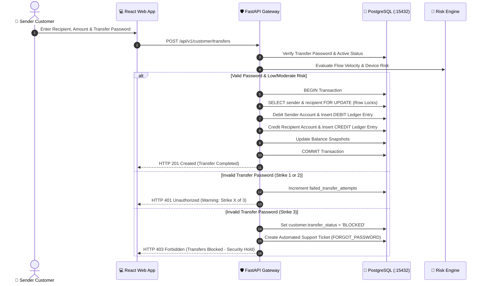
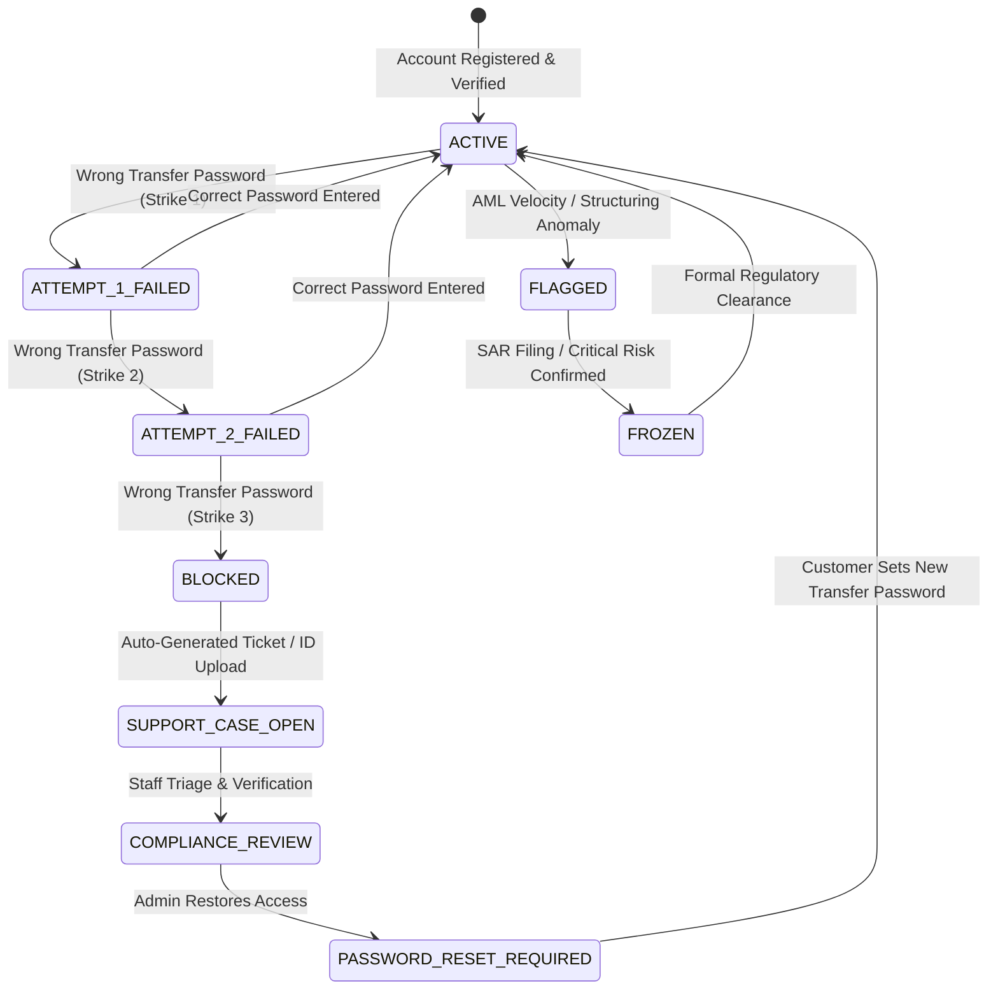
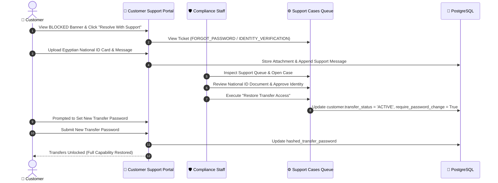
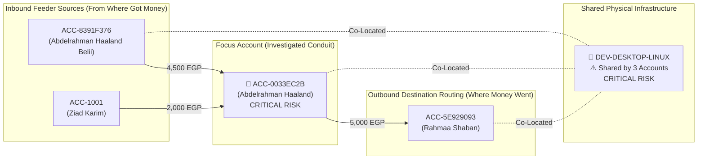
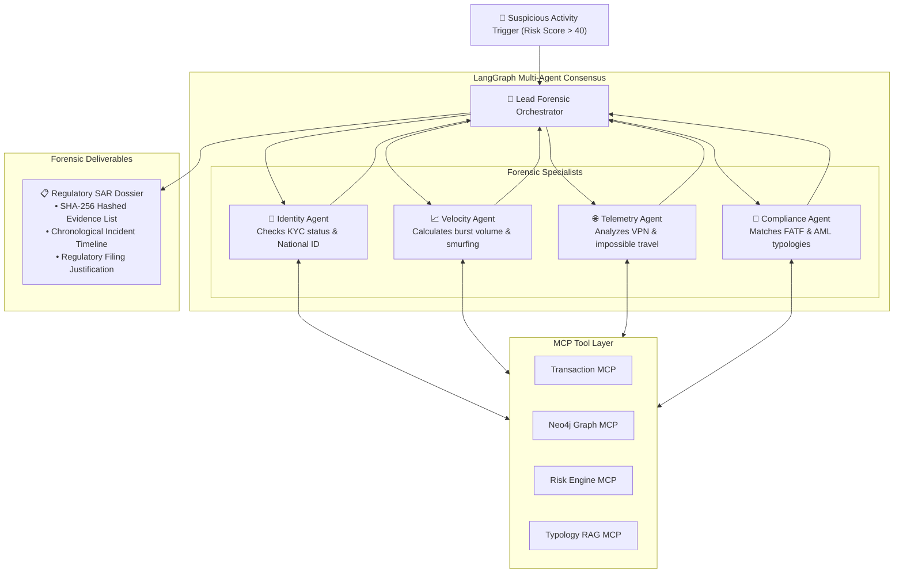

# 🛡️ Omerta.ai — System Architecture & Functionality Specification

<div align="center">

**Complete Technical Overview of Autonomous Financial Crime Investigation, Real-Time AML Defense, and Core Banking Infrastructure.**

</div>

---

## 📑 Table of Contents
1. [Executive Overview & Platform Mission](#1-executive-overview--platform-mission)
2. [End-to-End System Architecture](#2-end-to-end-system-architecture)
3. [Core Banking Engine & Double-Entry Ledger](#3-core-banking-engine--double-entry-ledger)
4. [Transfer Security & 3-Strikes Non-Logout Hold](#4-transfer-security--3-strikes-non-logout-hold)
5. [Customer Support & Identity Restoration Lifecycle](#5-customer-support--identity-restoration-lifecycle)
6. [Interactive Multi-Hop Network Topology & Fund Tracing](#6-interactive-multi-hop-network-topology--fund-tracing)
7. [Device & IP Intelligence (Localhost Co-Location Detection)](#7-device--ip-intelligence-localhost-co-location-detection)
8. [Multi-Agent AI Forensic Consensus Engine](#8-multi-agent-ai-forensic-consensus-engine)
9. [Role-Based Access Control & Master Credentials Matrix](#9-role-based-access-control--master-credentials-matrix)
10. [Step-by-Step GitHub Pull & Run Guide](#10-step-by-step-github-pull--run-guide)

---

## 1. Executive Overview & Platform Mission

Traditional Anti-Money Laundering (AML) and fraud detection tools are fragmented: core banking transaction logs reside in relational silos, fraud alerts are static rules evaluated hours after execution, and investigations require human analysts to manually copy-paste logs across disparate systems.

**Omerta.ai** unifies core banking execution with active defense and autonomous AI agentic forensics:
- **Zero-Trust Transfer Layer**: Segregates account login from funds transfer authorization with cryptographic dual passwords and real-time velocity monitoring.
- **Dynamic Entity Topology**: Real-time graph computation linking bank accounts, physical hardware devices, and network endpoints to uncover structuring rings and money mule conduits.
- **Autonomous Multi-Agent Consensus**: Deploys specialized LLM sub-agents querying relational (PostgreSQL) and graph (Neo4j) databases via Model Context Protocol (MCP) to draft auditable Suspicious Activity Reports (SAR).

---

## 2. End-to-End System Architecture

```mermaid
flowchart TB
    subgraph ClientTier [" 💻 Client Tier (Web & Telemetry) "]
        ReactUI[" React 18 + TypeScript + Vite SPA "]
        CustPortal[" 👤 Customer Banking Portal "]
        ComplianceHub[" 🛡️ Compliance & Forensic Center "]
        TelemetryTracker[" 📡 Hardware & IP Telemetry Engine "]
    end

    subgraph APITier [" ⚡ Application Tier (FastAPI Gateway :8000) "]
        AuthGateway[" 🔐 JWT Auth & Single-Session Guard "]
        BankingGateway[" 💳 Double-Entry Transfer Pipeline "]
        TicketGateway[" 💬 Support & Restoration Engine "]
        GraphGateway[" 🕸️ Subgraph & Topology Engine "]
        CaseGateway[" ⚖️ SAR & Regulatory Cases "]
    end

    subgraph AgentTier [" 🤖 Multi-Agent Forensic Tier (LangGraph) "]
        Orchestrator[" 🧠 Forensic Lead Orchestrator "]
        AgentKYC[" 🪪 Identity & KYC Sub-Agent "]
        AgentVelocity[" 📈 Velocity & Smurfing Sub-Agent "]
        AgentTelemetry[" 🌐 Geolocation & Device Sub-Agent "]
        AgentCompliance[" 📜 Regulatory & Typology Sub-Agent "]
    end

    subgraph MCPTier [" 🔌 Model Context Protocol (MCP) Layer "]
        MCP_Txn[" 📊 Transaction MCP Server "]
        MCP_Graph[" 🕸️ Graph Intelligence MCP Server "]
        MCP_Risk[" 🎯 Risk Engine MCP Server "]
        MCP_RAG[" 📚 AML Typology RAG MCP Server "]
    end

    subgraph DataTier [" 🗄️ Enterprise Dual-Persistence Tier "]
        Postgres[(" 🐘 PostgreSQL 16 (:15432)\n• OLTP Ledger (SELECT ... FOR UPDATE)\n• Accounts, Users, Tickets & Audit Logs ")]
        Neo4j[(" 🌐 Neo4j Graph 5.26 (:17687)\n• Topology Projections\n• Mule Networks & Shared Devices ")]
    end

    ClientTier --> APITier
    APITier --> DataTier
    APITier --> AgentTier
    AgentTier --> MCPTier
    MCPTier --> DataTier
```



---

## 3. Core Banking Engine & Double-Entry Ledger

All transactions within Omerta.ai adhere to strict financial double-entry bookkeeping rules. Money cannot be created or destroyed during transfers.

### Transfer Execution Workflow



---

## 4. Transfer Security & 3-Strikes Non-Logout Hold

### Security State Machine



- **Non-Logout Philosophy**: An incorrect transfer password locks **only outbound fund transfers**. The user's web session remains active, enabling them to navigate to the support center and submit identity proofs without being locked out of the banking app.

---

## 5. Customer Support & Identity Restoration Lifecycle



---

## 6. Interactive Multi-Hop Network Topology & Fund Tracing

The `/network` page provides real-time graph visualization for compliance officers and financial crime investigators:



### Risk Detection Heuristics
1. **Pass-Through Mule Conduit**: Inflow volume approximately matches outflow volume within short intervals (`inflow >= 2,000 EGP`, `ratio > 0.65`) $\rightarrow$ **CRITICAL Risk**.
2. **Fan-In Structuring (Smurfing)**: Multiple distinct inbound accounts sending sub-threshold amounts to a central collector $\rightarrow$ **CRITICAL Risk**.
3. **Shared Hardware Co-Location**: Multiple distinct banking accounts registered or transacting from the same physical device $\rightarrow$ **CRITICAL Risk**.

---

## 7. Device & IP Intelligence (Localhost Co-Location Detection)

When testing on localhost or deploying in production, Omerta.ai tracks client device fingerprints:
- **Localhost Hardware Binding**: Reuses existing desktop device records based on client browser user-agent and localhost loopback IPs (`127.0.0.1`, `::1`).
- **Dynamic Risk Counters**:
  - **1 Account on Device**: Normal operation (**LOW Risk**).
  - **2 Accounts on Device**: Multi-Account Hopping Warning (**HIGH Risk**).
  - **3+ Accounts on Device**: Syndicate / Shared Hardware Ring (**CRITICAL Risk** with red hazard pulsing in graph and `⚠️ MULTI-ACCOUNT (X ACCOUNTS)` badges in `/devices`).

---

## 8. Multi-Agent AI Forensic Consensus Engine



---

## 9. Role-Based Access Control & Master Credentials Matrix

| Role | Username / Email | Password | Account / Identifier | Initial Balance | Permissions |
| :--- | :--- | :--- | :--- | :--- | :--- |
| **`ADMINISTRATOR`** | `admin@omerta.ai` | `AdminPass123!` | System Super Admin | N/A | Full platform oversight, staff provisioning, risk tuning |
| **`FRAUD_ANALYST`** | `analyst@omerta.ai` | `AnalystPass123!` | Operations Center | N/A | Alert triage, support ticket resolution, risk reviews |
| **`INVESTIGATOR`** | `investigator@omerta.ai` | `InvestigatorPass123!` | Senior Forensics | N/A | SAR generation, multi-agent AI execution, case sign-off |
| **`AUDITOR`** | `auditor@omerta.ai` | `AuditorPass123!` | Audit Console | N/A | Read-only compliance audit trails and evidence verification |
| **`CUSTOMER`** | `ziad@omerta.ai` | `Customer@2026!` | `OMR-1092-4821` | 50,000.00 EGP | P2P transfers, support tickets, beneficiary management |
| **`CUSTOMER`** | `layla@omerta.ai` | `Customer@2026!` | `OMR-3847-1920` | 25,000.00 EGP | Standard checking account, transfer recipient |
| **`CUSTOMER`** | `amira@omerta.ai` | `Customer@2026!` | `OMR-7193-8402` | 120,000.00 EGP | High-net-worth customer profile |
| **`CUSTOMER`** | `omar@omerta.ai` | `Customer@2026!` | `OMR-9481-5632` | 15,000.00 EGP | Moderate risk testing customer profile |
| **`CUSTOMER`** | `nour@omerta.ai` | `Customer@2026!` | `OMR-5238-7104` | 80,000.00 EGP | High risk business customer profile |

---

## 10. Step-by-Step GitHub Pull & Run Guide

To run this repository from scratch after pulling from GitHub:

```bash
# 1. Clone or pull the repository
git clone https://github.com/abo7adeed/Omerta.ai.git
cd Omerta.ai

# 2. Copy environment file
cp .env.example .env

# 3. Launch PostgreSQL 16 & Neo4j 5 containers
docker compose up -d postgres neo4j

# 4. Install backend dependencies and apply migrations
uv sync
uv run alembic upgrade head

# 5. Populate deterministic demo seed data
uv run python -m infrastructure.database.seed

# 6. Install frontend packages & build
cd frontend
npm install
npm run build
cd ..

# 7. Start backend API server (Terminal 1)
uv run uvicorn apps.api.main:app --reload --port 8000

# 8. Start frontend dev server (Terminal 2)
cd frontend
npm run dev
```

- **Frontend App**: `http://localhost:5173`
- **Backend API Documentation**: `http://localhost:8000/docs`
- **Neo4j Browser Console**: `http://localhost:17474`
