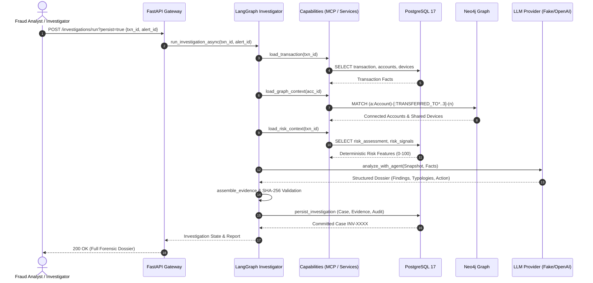

# Omerta.ai — Canonical System Architecture

**Document Version**: 1.0.0  
**Status**: Active / Production Blueprint  
**Primary Source of Truth**: PostgreSQL 17 Relational Database & Ledger

---

## 1. High-Level Architecture Topology

```
┌────────────────────────────────────────────────────────────────────────────────────────┐
│                                REACT FRONTEND (SPA)                                    │
│   Customer Portal (Transfers, Accounts, Tickets)  │  Staff Ops & Forensic Console     │
└───────────────────────────────────────────┬────────────────────────────────────────────┘
                                            │ HTTP / JSON (Bearer JWT)
                                            ▼
┌────────────────────────────────────────────────────────────────────────────────────────┐
│                               FASTAPI BACKEND GATEWAY                                  │
│   /api/v1/auth   /api/v1/accounts   /api/v1/transfers   /api/v1/tickets   /cases       │
└───────────────────────────────────────────┬────────────────────────────────────────────┘
                                            │
                                            ▼
┌────────────────────────────────────────────────────────────────────────────────────────┐
│                                DOMAIN SERVICE LAYER                                    │
│   AccountService │ TransferService │ CustomerService │ TicketService │ RiskService     │
└────────┬──────────────────────────────────┬─────────────────────────────────┬──────────┘
         │                                  │                                 │
         │ ACID Transactions                │ Cypher Read/Sync                │ Reads
         ▼                                  ▼                                 ▼
┌─────────────────────────────┐   ┌───────────────────────────┐   ┌──────────────────────┐
│        POSTGRESQL 17        │   │        NEO4J 5.26         │   │   KNOWLEDGE / RAG    │
│  (Financial Truth & Ledger) │──▶│   (Structural Projection) │   │ (In-memory TF-IDF +  │
│  - Double-entry Invariant   │   │   - Account-Device graph  │   │  Regulatory Chunks)  │
│  - Row-level Lock (FOR UPD) │   │   - Fund flow tracing     │   └──────────────────────┘
└────────┬────────────────────┘   └─────────────┬─────────────┘
         │                                      │
         └──────────────────┬───────────────────┘
                            ▼
┌────────────────────────────────────────────────────────────────────────────────────────┐
│                             MCP TOOL & CAPABILITY LAYER                                │
│   Transaction MCP Server │ Graph MCP Server │ Risk MCP Server │ Knowledge MCP Server   │
│                             (100% Read-Only Tools)                                     │
└───────────────────────────────────────────┬────────────────────────────────────────────┘
                                            │
                                            ▼
┌────────────────────────────────────────────────────────────────────────────────────────┐
│                          LANGGRAPH INVESTIGATION STATE MACHINE                         │
│  START -> init -> load_txn -> load_acc -> load_graph -> load_risk -> load_rag          │
│        -> analyze_with_agent (Fake/OpenAI) -> assemble_evidence (SHA-256) -> END       │
└───────────────────────────────────────────┬────────────────────────────────────────────┘
                                            │
                                            ▼
┌────────────────────────────────────────────────────────────────────────────────────────┐
│                        IMMUTABLE EVIDENCE & AUDIT PERSISTENCE                          │
│   - InvestigationCase (External ID, Status=REVIEW, Severity)                           │
│   - Evidence (SHA-256 Content Hash, Provenance Tier, Source Reference)                 │
│   - AuditEvent (Append-only Chronological Event Stream)                                │
└────────────────────────────────────────────────────────────────────────────────────────┘
```

---

## 2. Core Architectural Invariants

### 2.1 Double-Entry Banking & Concurrency Invariant
- **Rule**: Every movement of funds must be recorded as two balanced ledger entries within a single database transaction.
  $$\text{Debit}(\text{Sender Account}) + \text{Credit}(\text{Recipient Account}) = 0$$
- **Concurrency Protection**:
  ```sql
  SELECT * FROM accounts WHERE id = :sender_id FOR UPDATE;
  ```
  This row-level lock prevents concurrent overdrafts and race conditions.
- **Atomicity**: If any check fails (insufficient funds, blocked status, currency mismatch), the transaction rolls back completely.

### 2.2 Three-Strike Security Invariant
- **Rule**: Three consecutive failed transfer password attempts lock transfers without terminating customer login.
- **Backend Flow**:
  1. `failed_transfer_password_attempts` incremented atomically.
  2. At strike 3, `customer.transfer_status` becomes `"BLOCKED"`.
  3. Support ticket (`category="TRANSFER_SECURITY"`) is automatically created.
  4. Customer remains authenticated (`is_active = True`) with full read access to accounts, transactions, and support messages.
  5. Outgoing transfers return HTTP 403 `TRANSFER_LOCKED`.

### 2.3 Separation of Support Resolution vs Transfer Restoration
- **Rule**: Closing or resolving a support ticket NEVER unblocks customer transfers.
- **Restoration Requirement**:
  - Staff must explicitly invoke `POST /api/v1/tickets/{id}/restore-transfer`.
  - Creates a permanent `TransferRestoration` audit row.
  - Forces the customer to set a new transfer password on next transfer attempt.

### 2.4 Graph Projection Model
- **Rule**: PostgreSQL is the immutable financial source of truth. Neo4j is an indexed projection for graph algorithms.
- **Idempotency**: Neo4j projection is executed via `infrastructure.neo4j.projection.project_all()` using Cypher `MERGE` statements tagged with a `projection` property (`'dev'` or `'test'`).
- **Isolation**: Test graph projections never collide with or delete developer data.

### 2.5 Evidence Grounding & Integrity
- **Rule**: LLM agents are strictly forbidden from inventing evidence IDs.
- **Verification**:
  - Every fact collected from PostgreSQL, Neo4j, or Risk engines is assigned a unique `evidence_id`.
  - The LangGraph validation layer verifies that all `evidence_ids` cited in agent findings are subsets of the collected facts:
    $$\text{Finding}.\text{evidence\_ids} \subseteq \text{CollectedFacts}.\text{evidence\_ids}$$
  - Each persisted evidence row computes and stores a deterministic SHA-256 hash:
    $$\text{content\_hash} = \text{SHA-256}(\text{evidence\_id} \parallel \text{source} \parallel \text{data})$$

---

## 3. Technology Stack Breakdown

| Layer | Technology | Purpose |
|---|---|---|
| **Frontend Framework** | React 19 + TypeScript + Vite | Customer banking SPA & AML Investigation Console |
| **Styling & Icons** | Tailwind CSS + Lucide React | Modern dark-mode fin-tech UI design system |
| **API Gateway** | FastAPI (Python 3.12) | Asynchronous REST endpoints, JWT authentication, OpenAPI schema |
| **ORM & Database** | SQLAlchemy 2.0 (Async) + PostgreSQL 17 | Relational persistence, double-entry ledger, transaction locks |
| **Graph Database** | Neo4j 5.26 (Community) + Cypher | Structural analysis, money tracing, shared device clustering |
| **Tool Protocol** | Model Context Protocol (MCP) | 4 read-only servers for transaction, graph, risk, and knowledge |
| **Orchestration** | LangGraph + LangChain Core | Deterministic investigation state machine and specialist agent nodes |
| **LLM Provider** | Factory Abstraction (Fake / OpenAI) | Deterministic local test provider + live OpenAI/Groq endpoints |
| **Database Migrations** | Alembic | Version-controlled schema migrations |
| **Testing Suite** | Pytest + pytest-asyncio + Starlette TestClient | End-to-end banking, graph, security, and persistence test suites |

---

## 4. Component Boundaries & Data Flow


