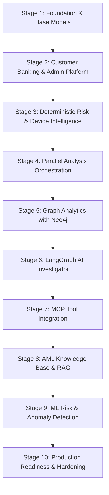

# Omerta.ai — Engineering & Product Roadmap (Stages 1–10)

**Product:** Omerta.ai — AI-Powered Digital Banking & Financial Crime Intelligence  
**Tagline:** See the Risk. Understand the Pattern. Protect the Network.

---

## Architecture Lifecycle Overview

Omerta.ai is structured into ten sequential, verifiable development stages. Each stage is strictly isolated with clear interfaces and unit/integration verification before proceeding.

---

## Stage 1 — Completed Foundation

- **Status:** COMPLETED
- **Description:** PostgreSQL schema initialization, basic FastAPI application setup, initial Pydantic schemas, and local dev containers.
- **Key Deliverables:**
  - Base models for users, accounts, transactions, and audit events.
  - Initial database connectivity and basic repository pattern.

---

## Stage 2 — Customer Banking & Admin Platform (CURRENT STAGE)

- **Status:** COMPLETED & VERIFIED
- **Description:** Interactive customer banking portal and separate administrative control center with strict data isolation, double-entry immutable ledgers, self-registration with initial demo balances, and deterministic review threshold (`risk_score > 40.00`).
- **Key Deliverables:**
  - **Customer Portal:** Self-registration, unique non-sensitive **Omerta User Number** (`OMR-XXXX-XXXX`), opening balance ledger entries, peer-to-peer transfers, customer-scoped transaction history, session tracking with VPN notice, and privacy consent controls.
  - **Admin Control Center:** Platform summary KPIs, user status management (suspend/reactivate with mandatory audit event), ledger-backed balance adjustments with mandatory compliance reason, transaction monitoring, human review queue, and investigation dossier view.
  - **Ledger Integrity:** Immutable `account_ledger_entries` (`OPENING_BALANCE`, `DEBIT`, `CREDIT`, `ADMIN_ADJUSTMENT`), row-level concurrency locking (`with_for_update()`), and transfer idempotency keys.
  - **Design System:** Polished fintech dark palette (`#080D19`, `#0B1220`, `#101A2B`, `#152238`, `#3978F6`, `#29C5D9`, `#27C58B`, `#F4B942`, `#F06470`), Inter typography, and tabular numerals.
  - **Testing:** Comprehensive Pytest test suite covering registration, isolation, transfers, review rules, and admin actions.

---

## Stage 3 — Deterministic Risk and Device Intelligence

- **Status:** PLANNED (NEXT STAGE)
- **Description:** Multi-factor deterministic risk engine calculating explainable 0–100 risk scores from transaction behaviors, device fingerprints, and network/IP telemetry.
- **Key Components:**
  - `DeviceIntelligenceService`: New-device detection, multiple-accounts-per-device detection, emulator/root detection.
  - `NetworkIntelligenceService`: IP geolocation delta, VPN/proxy/datacenter detection, country hopping signals.
  - `TransactionBehaviorService`: High-velocity transfers, unusual amount vs. historical baseline, round-trip onward transfers.
  - `RiskAssessmentService`: Multi-signal weighted aggregation, signal confidence calibration, and deterministic explanation generator.

---

## Stage 4 — Parallel Analysis Orchestration

- **Status:** PLANNED
- **Description:** Asynchronous parallel orchestration engine evaluating independent risk tools concurrently with strict timeouts and resilient fallbacks.
- **Key Components:**
  - Async task gathering for Transaction, Device, and Network analyzers.
  - Per-tool circuit breakers, timeouts (e.g. 500ms max per analyzer), and graceful degradation.
  - Preserved individual tool result payloads and correlation IDs.

---

## Stage 5 — Graph Analytics with Neo4j

- **Status:** PLANNED
- **Description:** Graph database integration to uncover money mules, circular routing, rapid onward transfers, and shared device rings.
- **Key Components:**
  - Real-time graph synchronization (`Account`, `Customer`, `Device`, `IPAddress`, `Transfer`).
  - Graph Cypher algorithms: Cycle detection, shortest path analysis, mule account community detection.
  - Interactive SVG/Canvas network graph visualization in the Admin Center.

---

## Stage 6 — LangGraph AI Investigator

- **Status:** PLANNED
- **Description:** Autonomous AI investigation agent built with LangGraph to analyze suspicious cases (`risk_score > 40.00`), synthesize multi-source evidence, and generate structured investigation dossiers.
- **Key Components:**
  - Typed state machine: evidence gatherer, anomaly analyzer, hypothesis builder, report generator.
  - Strict read-only tool boundaries; human-in-the-loop disposition and review sign-off.
  - Grounded reasoning with traceable citations and confidence intervals.

---

## Stage 7 — MCP Tool Integration

- **Status:** PLANNED
- **Description:** Model Context Protocol (MCP) tool servers exposing standardized, read-only intelligence endpoints for external agents and auditors.
- **Key Components:**
  - `omerta-mcp-transactions`: Query transactions, ledger balances, and counterparties.
  - `omerta-mcp-devices`: Device telemetry, emulator flags, and session history.
  - `omerta-mcp-graph`: Multi-hop relationship querying.

---

## Stage 8 — AML Knowledge Base and RAG

- **Status:** PLANNED
- **Description:** Retrieval-Augmented Generation system grounded in FATF guidance, FinCEN advisories, and banking compliance regulations.
- **Key Components:**
  - Vector embeddings for AML typologies, structuring rules, and red-flag indicators.
  - Grounded regulatory citations in generated investigation reports without hallucinations.

---

## Stage 9 — ML Risk and Anomaly Detection

- **Status:** PLANNED
- **Description:** Supervised and unsupervised machine learning models complementing deterministic rules.
- **Key Components:**
  - Gradient boosted trees (LightGBM/XGBoost) for tabular transaction fraud scoring.
  - Isolation forests and autoencoders for behavioral outlier detection.
  - Model versioning, drift monitoring, and feature store integration.

---

## Stage 10 — Production Readiness & Enterprise Hardening

- **Status:** PLANNED
- **Description:** Enterprise hardening, security compliance, automated CI/CD pipelines, and scalability optimizations.
- **Key Components:**
  - Rate limiting, DDoS defense, WAF integration, and strict CORS.
  - Distributed caching with Redis.
  - SOC2 / ISO 27001 audit logging compliance and automated backup/restore runbooks.
